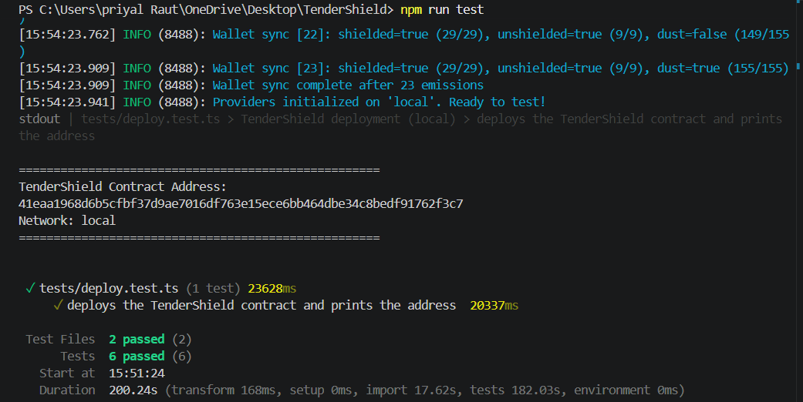
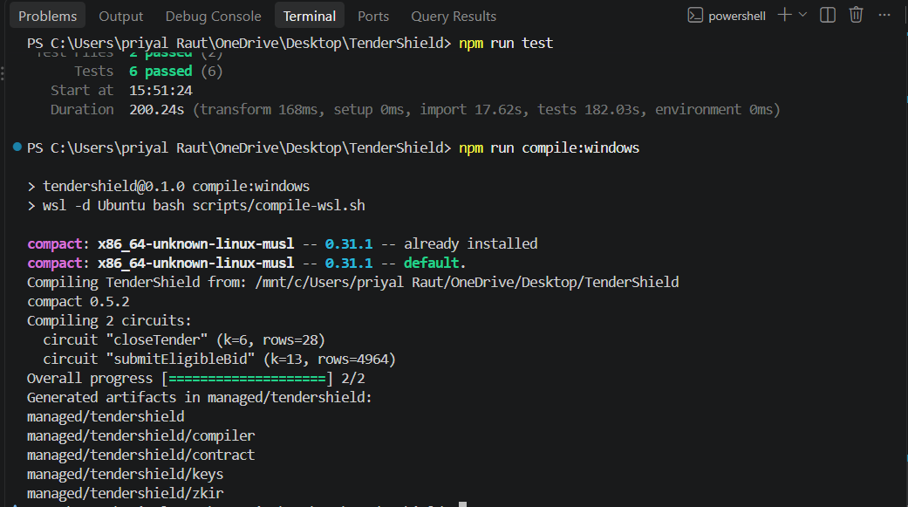

# TenderShield

**Privacy-preserving procurement & bidding on Midnight.**

TenderShield is a Level 1 (toolchain + first contract + deployment) prototype for the
Midnight Builder Challenge. It shows how a **procurement tender** can verify a vendor's
eligibility inside a zero-knowledge circuit **without ever publishing the vendor's
credentials** — only a commitment reaches the chain.

## The idea (one paragraph)

Public procurement has painful collision between **openness** (everyone must be able to
verify that a winner was eligible) and **disclosure** (firms do not want to broadcast
revenue, headcount, registrations, or other sensitive qualifying data to every competitor).
TenderShield lets a contracting authority publish a tender with an eligibility rule and a
minimum threshold; bidders then **prove** they meet the rule privately. The smart contract
records only a cryptographic commitment to the winning bid, so compliance is verifiable by
anyone while the underlying figures stay hidden. A later level can extend this into a full
sealed-bid auction: private bids, a commitment phase, a reveal phase, and an auditable award
— all without leaking any losing bidder's numbers.

## What this Level-1 build does

- A Compact contract that deploys a tender with public parameters (`tenderId`,
  `minTurnover`, `status`).
- A `submitEligibleBid` circuit that:
  - asserts the tender is still `OPEN`,
  - asserts `annualTurnover >= minTurnover` privately,
  - writes only `persistentCommit([vendorId, turnover])` to the ledger, and
  - transitions the tender to `AWARDED`.
- A `closeTender` circuit that lets the owner close bidding early.
- A generated `managed/` directory (Circuits + keys) from `compact compile`.
- A full test suite that runs against the **local devnet** (testkit + Docker).

## Public state vs private witness

| Ledger (public, on-chain) | Witness (private, inside the circuit) |
| --- | --- |
| `tenderId` — public tender identifier | `vendorId` — vendor identity |
| `minTurnover` — eligibility threshold (disclosed) | `annualTurnover` — the vendor's actual figure |
| `status` — `OPEN / CLOSED / AWARDED` | `opening` — the commitment's random nonce |
| `turnoverCommitment` — hash commitment | — |

Only `disclose()` in the **constructor** publishes the tender parameters. Everything about an
individual vendor stays private; readers can verify the *state transition* but cannot learn
`annualTurnover`, `vendorId`, or the `opening` from the commitment already on chain.

## Repository layout

```
contracts/
  tendershield.compact     the Compact contract
  index.ts                 TS bridge to the compiled contract
managed/tendershield/      generated artifacts: compiler/, contract/, keys/, zkir/
src/                       wallet, providers, config and shared harness
tests/                     contract test suite + deploy test
scripts/                   compile-wsl.sh, show-address.ts, diag.ts, debug-deploy.ts
compose.yml                local Midnight devnet (node, indexer, proof server)
.github/workflows/ci.yaml  CI: compile + start devnet + run tests
```

## Prerequisites

- Node.js **>= 22** (tested on 22+; older versions are not supported by Midnight)
- npm, Docker Desktop (engine running)
- WSL with an Ubuntu distro *(Windows only)* — the Compact compiler has **no Windows
  binaries**, so `contracts` are compiled inside WSL
- The `compact` CLI (`v0.5.2`) with **toolchain 0.31.1** (`compact update 0.31.1`).

> Version pairing used everywhere in this repo is verified:
> Compact toolchain `0.31.1` ∈ language `0.23.0`, runtime `0.16.0` — the exact set the
> Midnight SDK (`midnight-js-protocol 4.1.1`, `wallet-sdk 1.2.0`) is built against.

## Setup + run locally

```bash
# 0. Install Node deps
npm install

# 1. Compile the contract (WSL on Windows; plain `compact compile` on Linux/macOS)
npm run compile:windows

# 2. Start the local devnet (node + indexer + proof server)
docker compose up -d --wait

# 3. Run the full test suite against the local devnet (2 files, sequential)
npm run test:local
```

The suite covers: deploy + public parameters, awarding to an eligible bid (commitment only),
rejecting an ineligible bid, privacy checks (sensitive values never reach the ledger), and
rejecting bids after the tender is closed — plus a deployment smoke test that prints the
contract address.

## Deployment

This entry is deployed on **two** networks:

1. **Preview / Preprod requirement**: deployed on **Midnight Preview** (`networkId:
   `preview``) using a seed-funded wallet. Verified twice: `npm run deploy:preview`
   printed the contract address, and the live indexer at `indexer.preview.midnight.network`
   returns the address as a `ContractDeploy` action on the ledger.
2. **Local devnet**: deployed on the local Midnight devnet (`networkId: undeployed`,
   see [`compose.yml`](compose.yml)), with the address verified via the local indexer.

```bash
# Local (runs the whole suite, prints a contract address)
docker compose up -d --wait
npm run test:local

# Preview (needs a funded wallet in .env.preview)
npm run deploy:preview
```

### Deployed contract address — **Preview** (query it yourself)

```graphql
query {
  contractAction(address: "baecf02476ec56f454dd540d72541c50968452c40f6571c27396ebcdcef68b59") {
    __typename
    ... on ContractDeploy { transaction { hash } }
  }
}
```

| Network | Contract address | Deploy tx | Verified |
| --- | --- | --- | --- |
| **Preview** | `baecf02476ec56f454dd540d72541c50968452c40f6571c27396ebcdcef68b59` | `ef3944944114d7bc07bb6942ca070a21c03d0010a3cd290d7bc6bd99247f0a1f` | ✅ public indexer returns `ContractDeploy` |
| **Local (undeployed)** | `f09a4b72156067f353c53a3cf06706dd1145f406f6f13d73421a9de6c85a6742` | `f8109c34b901b4b2173f7181d1f2c328c001462f6a27a25e4e14a1b1d41940f1` | ✅ local indexer returns `ContractDeploy` |

> The wallet used for local runs is the repo's dev wallet
> (`ALICE_LOCAL_SEED = 0x…01`); its address is in the local `undeployed` network
> format (e.g. `mn_addr_undeployed1r7cckf3mkf4r5yhjs07hg948jrgjzp3gq6dse7xwz9usf8rx4uwsha9pp4`).
> The Preview run uses the seed wallet in the git-ignored `.env.preview`. Note that the
> Preview chain is large (~250k blocks), so a fresh wallet resync takes a while on first run.

## Screen-shots / evidence

- Compile output: `compiling 2 circuits` from `compact compile` (see `npm run compile:windows`)
  and the generated `managed/tendershield/{compiler,contract,keys,zkir}` tree.

  

- Local deployment: `npm run test:local` prints the contract address from `tests/deploy.test.ts`.

  

## Troubleshooting (Windows)

- **`compact` has no Windows binary** → always run compilation through `scripts/compile-wsl.sh`
  (WSL Ubuntu). PowerShell prints `NativeCommandError` noise on stderr — it is cosmetic.
- **Indexer has no network / `fetch failed` on `:8088`**: the indexer container can lose its
  compose network after a failed port-bind. Recreate it with
  `docker compose up -d --force-recreate indexer`.
- **First devnet boot is slow**: the proof-server image downloads its ZK proving keys from a
  public bucket on first start before it can prove anything; expect several minutes on slow
  connections and don't run tests until it reports healthy.

## License / notes

Challenge entry — nothing here is production software. All values shown on the local devnet
are test data.